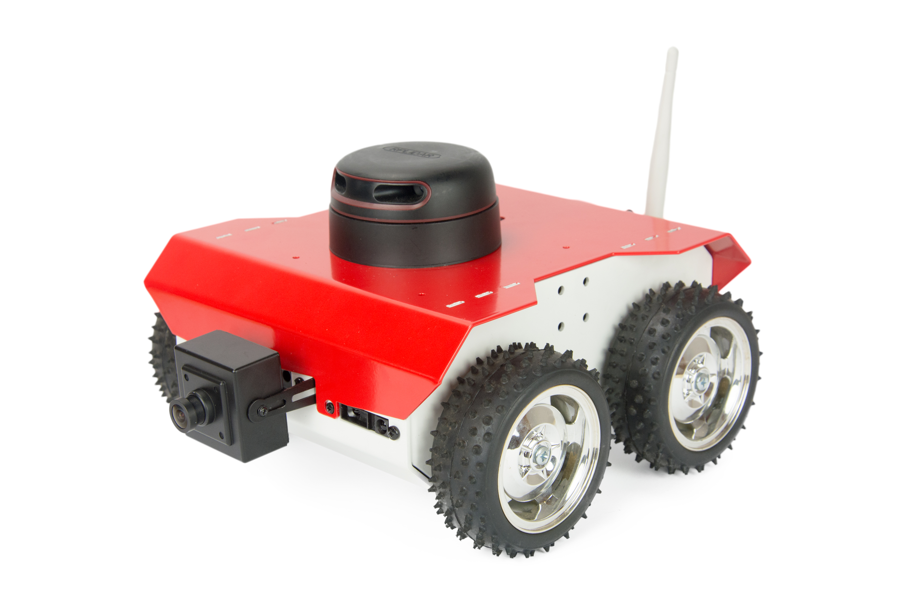
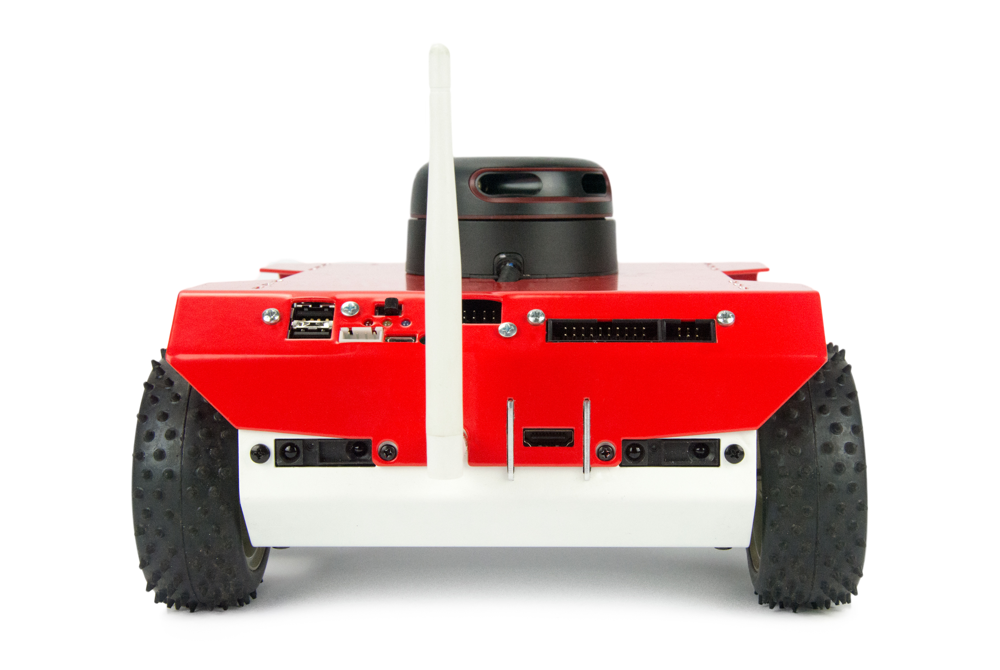
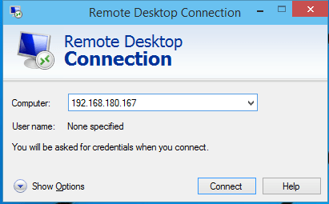

# ROS introduction

"The Robot Operating System (ROS) is a flexible framework for writing robot software. It is a collection of tools, libraries, and conventions that aim to simplify the task of creating complex and robust robot behavior across a wide variety of robotic platforms." - according to the official [ROS webpage](http://www.ros.org/about-ros/).

<div>
<center></center>
</div>

We prepared a set of tutorials to help you start building advanced robots. They are prepared to work with Husarion CORE2-ROS controller but they are also a valuable portion of knowledge for anybody interested in ROS.

## System structure

ROS is a software suite which allows for quick and easy building of
autonomous robotic systems. ROS should be considered as a set of tools for
creating new solutions or adjusting already existing ones. A major
advantage of this system is a great set of drivers and implemented
algorithms widely used in robotics.

### Nodes

Base unit in ROS is called a node. Nodes are in charge of handling devices or
computing algorithms- each node for separate task. Nodes can communicate
with each other using topics or services. ROS software is
distributed in packages. Single package is usually developed for
performing one type of task and can contain one or multiple nodes.

### Topics

In ROS, topic is a data stream used to exchange information between
nodes. They are used to send frequent messages of one type. This could
be a sensor readout or motor goal speed. Each topic is registered under
the unique name and with defined message type. Nodes can connect with it
to publish messages or subscribe to them. For a given topic, one node can
not publish and subscribe to it at the same time, but there is no
restrictions in the number of different nodes publishing or subscribing.

### Services

Communication by services resemble client-server model. In this mode one
node (the server) registers service in the system. Later any other node can
ask that service and get response. In contrast to topics, services allow
for two-way communication, as a request can also contain some data.

## Basic tools

While working with ROS there are some tools that are most useful. They are
intended to examine nodes and topics.

### rosnode

Rosnode is a command line application for examining which nodes are
registered in the system and also checking their statuses. 

Using the application looks as follows:

``` bash
     $ rosnode command [node_name]
``` 

Command could be:

- `list` - display list of running nodes

- `info` - display info regarding selected node

- `kill` - stop selected node

Detailed info could be found in
[ROS documentation](http://wiki.ros.org/rosnode).

### rostopic

Rostopic is a command line application for examining which topics are
already being published and subscribed, checking details of the selected topic
or reading messages being sent in it. 

Using the application looks as follows:

``` bash
     $ rostopic command [topic_name]
``` 

Command could be:

- `list` - display list of topics

- `info` - display info regarding selected topic

- `echo` - display messages published in the topic

Detailed info could be found in
[ROS documentation](http://wiki.ros.org/rostopic).

### rqt\_graph

`rqt_graph` is graphical tool for visualization of data flow across different nodes
in the system. 

Using the application looks as follows:

``` bash
     $ rqt_graph
```

## Robot platform

This tutorial is created for ROSbot, open-source robot platform. You can read more about it here: [ROSbot manual](https://husarion.com/manuals/rosbot-manual/). 

The platform contains:
- 1 × Husarion CORE2-ROS version with ASUS Tinker Board
- 1 × RPLIDAR A2 360°
- 1 x RGBD camera Orbbec Astra
- 1 × MPU9250
- 4 × VL53L0X Time-of-Flight Distance Sensor

And this is how it looks like:

<div>
<center></center>
</div>

<div>
<center></center>
</div>

You can also test the performance of ROSbot using our simulation model in Gazebo environment. It is available here, at our <a href="https://github.com/husarion/rosbot_description">GitHub page</a>.

You can use simulation model on a ready to go virtual machine, which you can download from <a href="https://files.husarion.com/husarion-vm.vmdk.xz">our file server</a>. Virtual machine is already configured with all required packages and you can use it with minimal setup effort.

Another option is to use ROS native installation, this requires Ubuntu 16.04 operating system and you will have to install ROS with Gazebo according to this <a href="http://wiki.ros.org/kinetic/Installation/Ubuntu">guide</a>. Native installation requires a bit of experience with linux and command line, but will offer much better performance camparing to virtual machine.

You can also try online simulator at <a href="http://www.theconstructsim.com/">www.theconstructsim.com</a>, it comes with all required packages installed and offer great computing power for a reasonable price.

We also created package with all nodes and launch files from our ROS tutorials. You can download ready to use pkg from <a href="https://github.com/husarion/tutorial_pkg">GitHub page</a>.


## ROS and CORE2 Work flow

According to the method of your choice, proceed to section **Connecting to ROSbot** or **Starting Gazebo**.

#### Connecting to ROSbot

Before you start working with ROS on CORE2 platform, you need to connect
your device first. You can establish connection in two ways: using `ssh` or via
remote desktop. For both methods you need an IP address of your CORE2-
it could be found on cloud.husarion.com after clicking “more” button
next to robot name.

To connect by ssh type in terminal:

``` bash
    $ ssh husarion@xxx.xxx.xxx.xxx
``` 

password is:  `husarion`

To connect via remote desktop you need a remote desktop client
application. Depending on your system, you may have various clients.

Parameters for connection are the following:

<table>
    <tr>
        <td>protocol</td><td>`rdp`</td>
    </tr>
    <tr>
        <td>server</td><td>`xxx.xxx.xxx.xxx`</td>
    </tr>
    <tr>
        <td>username</td><td>`husarion`</td>
    </tr>
    <tr>
        <td>password</td><td>`husarion`</td>
    </tr>
</table>


If you are working on Windows, press `WinKey + r` then type `mstsc`.

You will see a window appear:

<div><center></center></div>

Type in your device IP address and click `connect`. If you are working on
Mac, you can use **Microsoft Remote Desktop** available at **AppStore**.
If you are working on Ubuntu, you can use **Remmina**.


The first step in working with ROS is to run master process called roscore.
This node handles registration of other nodes, topics and services. After
this step is complete you can run your nodes. 

To start the master process you can use command:

``` bash
    $ roscore
``` 

#### Starting Gazebo

To start using Gazebo with ROSbot model you need to download our package with model and configuration files to ROS workspace directory. Meaning and structure of workspace will be discussed later, now you will just create it with:

```bash
    $ mkdir -p ~/ros_workspace/src
    $ cd ~/ros_workspace/src
    $ catkin_init_workspace
    $ sudo apt update
    $ git clone https://github.com/husarion/rosbot_description.git
    $ cd ~/ros_workspace 
    $ catkin_make
    $ source devel/setup.sh
```

From now your system is ready to run Gazebo with ROSbot. To start simulator use command:

```bash
    $ roslaunch rosbot_gazebo rosbot_world.launch
```

### Starting system step by step

You can start ROS nodes by typing name of each node manually.

To do it you can use the following command:

``` bash
    $ rosrun package_name node_type [options]
``` 

Package\_name and node\_type are names of package and node that you want
to run. `rosrun` executes node in the terminal and outputs text logs to the screen. To start multiple nodes simultaneously use `roslaunch`. You will learn about this tool soon.

#### Defining node name

If you want to bind specific identifier to a node, at the end of the
command, add:

``` bash
    __name:=new_node_name
``` 

Note that there are two underscores before the name. If you want to learn more about naming convention used by ROS see [this](http://wiki.ros.org/ROS/Concepts#Names.Names) docs.

#### Setting parameter

You can also set parameter value by adding:

``` bash
    _param:=value
``` 

Note that there is an underscore before the parameter name.

To find what kind of parameters you can set, and what type of data is
accepted, check documentation for exact node.

#### Remapping topic name

If you want to change the name of the topic subscribed or published by a node, you
can use remapping option. In order to do it, at the end of the command, add:

``` bash
    old_topic_name:=new_topic_name
``` 

Note that there is no underscore before the old name.

### Starting system step by step - Example

In this section, we will set up ROS system that is equipped with a Orbbec Astra 
camera and show image from camera on display. Use remote desktop client of your choice to connect to your ROSbot or Core2ROS. In case of latter remember to plug in Orbbec Astra camera to your SBC. You can also follow the tutorial in simulation mode using Gazebo and Husarion VM.

#### Starting master

We will begin with master by typing in the following code in the ecommand line:

``` bash
    $ roscore
``` 

You should see something like this:


Now you can use tools from chapter 2 in order to examine your system,
don’t worry that you didn’t start any node yet.

#### Examining nodes

Let’s begin by checking the list of existing nodes.
In the new terminal type in:

``` bash
    $ rosnode list
``` 

As the output you should get:

``` bash
    husarion@core2-ros:~$ rosnode list 
    /rosout
``` 

This means, that you have now one node running which name is `/rosout`
and it is responsible for handling console log mechanism. 

Next you can check some info about this node:

``` bash
    $ rosnode info /rosout
``` 

And as the output you should get:

``` bash
    husarion@core2-ros:~$ rosnode info /rosout 
    -------------------------------------
    Node [/rosout]
    Publications: 
     * /rosout_agg [rosgraph_msgs/Log]
     
    Subscriptions: 
     * /rosout [unknown type]
     
    Services: 
     * /rosout/set_logger_level
     * /rosout/get_loggers
     
    contacting node http://core2-ros:48067/ ...
    Pid: 4594
``` 

You can see here that node `/rosout` is publishing to topic
`/rosout_agg`, subscribing topic `/rosout` and offering two services:
`/rosout/set_logger_level` and `/rosout/get_loggers`.

#### Examining topics

Now we will check what topics are registered in the system and receivee some
info about them. In new console type in:

    $ rostopic list

You should get in the output:

    husarion@core2-ros:~$ rostopic list 
    /rosout
    /rosout_agg

This means that you have two topics registered in the system. Let’s get
some info about first of them:

    $ rostopic info /rosout

As the output you should get:

    husarion@core2-ros:~$ rostopic info /rosout
    Type: rosgraph_msgs/Log
    
    Publishers: None
    
    Subscribers: 
     * /rosout (http://core2-ros:33119/)

From that you can read, that via topic `/rosout` only messages of type `rosgraph_msgs/Log` can be transmitted, there is no node that publishes to this topic and node `/rosout` subscribes it. 

Now, leet's try to get similar info about the second topic:

    $ rostopic info /rosout_agg

As the output you should get:

    husarion@core2-ros:~$ rostopic info /rosout_agg 
    Type: rosgraph_msgs/Log
    
    Publishers: 
     * /rosout (http://core2-ros:33119/)
     
    Subscribers: None

From that you can read, that via topic `/rosout_agg` only messages of type `rosgraph_msgs/Log` can be transmitted, node `/rosout` publishes to this topic and there is no node that subscribes it.

#### Starting camera node

If you are using simulator, you can skip this section, as the driver for camera will not be necessary.

Now you will run few nodes for handling Astra camera device. For this task you should use `astra.launch` from package `astra_launch` because this is the default camera installed in ROSbot. 
We will explain how `launch` file works later. 

You can start camera nodes by typing in the terminal:

```
$ roslaunch astra_launch astra.launch
```

As output you should get something like below:


**Task 1** 

Use `rosnode` and `rostopic` tools to check if new nodes or
topic appeared in the system. Next find some info regarding new node and
topics.

#### Starting image view node

Now you have camera node running, but can not see image from it yet. You will use node `image_view` from `image_view` package. This node by default subscribes to topic `image`. You need to remap this name to topic published by the camera node. If you performed task 1, you should know that astra nodes are publishing to many topics. To run image view node with remapping topic name type in the terminal:

```
    $ rosrun image_view image_view image:=/camera/rgb/image_raw
```

As the output you should get:


**Note for simulator**: Simulated environment consist of simple objects (plains, boxes etc.), due to this, image from camera will consist of simple shapes like triangles or rectangles.

**Task 2** 

Use `rosnode` and `rostopic` tools to check what changed in
the system after running another node. Notice what changed in properties
of `/camera/rgb/image_raw` topic.

#### Examining system with rqt\_graph

Now you will use `rqt_graph` tool in order to get graph of data flow in
the system. In new terminal type in:

    $ rqt_graph

There will be no response in the terminal, but new window will appear. In upper left corner change "Nodes only" option to "Nodes/Topics (active)". You will see:


Interpretation of the graph is as follows:

-   Ovals represent nodes

-   Rectangles represent topics

-   Big rectangles containing other elements represent namespace (shared part of the name)

-   Arrows pointing from node to topic represent publication to this
    topic

-   Arrows pointing from topic to node represent subscription to this
    topic

### Starting system with `roslaunch`

`Roslaunch` is a tool that simplifies running of multiple nodes at the samee
time. This tool uses `.launch` files which contain configuration of all
nodes to be run. Usage of `roslaunch` is simple. In the new terminal type in:

    roslaunch package file.launch

or

    roslaunch file.launch

The first one is for the case when you use launch file provided with
the package- you can run it from any folder. The second option is when you
use standalone launch file- you must run it in the folder where the launch
file is located or point the path to it.

#### Structure of .launch file 

Structure of `.launch` file is defined in a markup language derived from XML and similar to
HTML. Content of the `.launch` file is inserted between the start and end tags: `<launch>...</launch>` (root element). Other elements including those that define nodes should be placed between them. 
You can define node using `node` element:

``` launch
    <node pkg="package_name" type="node" name="id" required="true" output="screen">
    </node>
``` 

Where fields `pkg`, `type` and `name` are required, rest are optional.

Meaning of each field:

-   `pkg` - name of the epackage

-   `type` - node to be run

-   `name` - id which will be binded to the node

-   `required` - if true, all nodes in the `.launch` file will be
    stopped if this node stops or fails, default value is false.

-   `output` - if value is `screen` node output will be directed to
    screen, if value is `log` output will be directed to log file,
    default is log.

For each node parameters can be set or topics can be remapped.

For setting parameters use element `param`:

``` launch
    <param name="name" value="value"/>
``` 

Meaning of the fields:

-   `name` - name of the parameter

-   `value` - desired value of the parameter

For remapping the topic names use element `remap`:

``` launch
    <remap from="/old" to="/new"/>
``` 

Meaning of the fields:

-   `from` - old topic's name

-   `to` - desired topic's name

### Starting system with `roslaunch` - Example

In this section we will start the same nodes as in previous example, but
this time with use of `roslaunch` tool.

At first you will need a `.launch` file.

``` launch
<launch>
    <arg name="use_rosbot" default="true"/>
    <arg name="use_gazebo" default="false"/>

    <include if="$(arg use_rosbot)" file="$(find astra_launch)/launch/astra.launch"/>
    <include if="$(arg use_gazebo)" file="$(find rosbot_gazebo)/launch/rosbot_world.launch"/>
    <include if="$(arg use_gazebo)" file="$(find rosbot_gazebo)/launch/rosbot.launch"/>

    <node pkg="image_view" type="image_view" name="image_view">
        <remap from="/image" to="/camera/rgb/image_raw"/>
    </node>

</launch>  
``` 

Copy the above code to text editor (and other parameters if needed) and save it to file `tutorial_1.launch` in your home directory.

Next, close all consoles and nodes that are already running, go to new
terminal and, if working on ROSbot, type in:

```bash
    $ roslaunch tutorial_1.launch
```

In case of working with Gazebo:
```bash
    $ roslaunch tutorial_1.launch use_rosbot:=false use_gazebo:=true
```
You should get output like this:


Notice that you do not need to run `roscore` before using `roslaunch`,
if `roscore` is not running already, `roslaunch` will run it before
starting nodes. 

**Task 3** 

Use `rosnode`, `rostopic` and `rqt_graph`
tools to examine system started with use of `roslaunch`, there should be
no difference in comparison to the esystem started step by step.

## Summary

After completing this tutorial you should know what are the basic
components and tools of ROS. You should know two methods for starting a
node, setting parameters and remapping topic names. You should be able
to check what nodes are running in system and to which topics they are
publishing and subscribing.


---------

*by Łukasz Mitka, Husarion*

*Do you need any support with completing this tutorial or have any difficulties with software or hardware? Feel free to describe your thoughts on our community forum: https://community.husarion.com/ or to contact with our support: support@husarion.com*

