# Simple kinematics for mobile robot #


## A little bit of theory ##

### Introduction ###

The purpose of forward kinematics in mobile robotics is to determine robot
position and orientation based on wheels rotation measurements. To achieve that we'll create robot kinematic model. ROSbot is four wheeled mobile robot with separate drive for each wheel, but in order to simplify kinematic calculation we will treat it as two wheeled. Two virtual wheels (marked as W<sub>L</sub> and W<sub>R</sub> on the schematic) will have axis going through robot geometric center. This way we can use simpler kinematic model of differential wheeled robot. The name "differential" comes from the fact that robot can change its direction by varying the relative rate of rotation of its wheels and does not require additional steering motion. Robot schematic is presented below:

<div><center>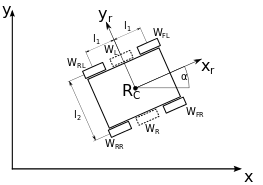</center></div>

Description:

-   <div>R<sub>c</sub> - robot geometric centre</div>
-   <div>x<sub>c</sub> - robot geometric centre x position</div>
-   <div>y<sub>c</sub> - robot geometric centre y position</div>
-   <div>x<sub>r</sub> - robot local x axis that determines front of the robot</div>
-   α - robot angular position
-   <div>W<sub>FL</sub> - front left wheel</div>
-   <div>W<sub>FR</sub> - front right wheel</div>
-   <div>W<sub>RL</sub> - rear left wheel</div>
-   <div>W<sub>RR</sub> - rear right wheel</div>
-   <div>W<sub>L</sub> - virtual left wheel</div>
-   <div>W<sub>R</sub> - virtual right wheel</div>
-   <div>l<sub>1</sub> - distance between robot centre and front/rear wheels</div>
-   <div>l<sub>2</sub> - distance between robot left and right wheels</div>

Our mobile robot has constraints. It can only move in `x-y` plane and it has 3 DOF (degrees of freedom). However not all of DOFs are controllable which means robot cannot move in every direction of its local axes (e.g. it cannot move sideways). Such drive system is called **non-holonomic**. When amount of controllable DOFs is equal to total DOFs then a robot can be called **holonomic**. To achieve that some mobile robots are built using Omni or Mecanum wheels and thanks to vectoring movement they can change position without changing their heading (orientation). 

### Forward Kinematics task ###

The robot position is determined by a tuple (x<sub>c</sub>, y<sub>c</sub>, α). The forward kinematic task is to find new robot position (x<sub>c</sub>, y<sub>c</sub>, α)' 
after time *δt* for given control parameters:
* <div>v<sub>R</sub> - linear speed of right virtual wheel
* <div>v<sub>L</sub> - linear speed of left virtual wheel

In our case the angular speed ω and the angular position Φ of each virtual wheel will be an average of its real counterparts:

<div><center>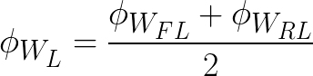</center></div>
<div><center>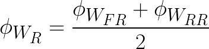</center></div>
<div><center>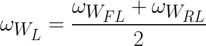</center></div>
<div><center>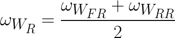</center></div>

Linear speed of each virtual wheel:

<div><center>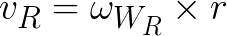</div></center>
<div><center>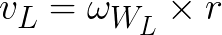</div></center>

where *r* - the wheel radius.

We can determine robot angular position and speed with:

<div><center>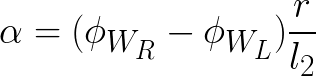</div></center>
<div><center>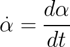</center></div>

Then robot speed x and y component:

<div><center>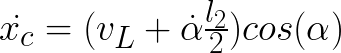</center></div>
<div><center>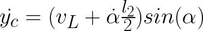</center></div>

To get position:

<div><center>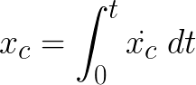</center></div>
<div><center>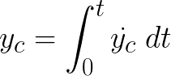</center></div>

We assume starting position as (0,0).

In order for code to work correctly wheels should be connected to ports in following manner:

-   <div>front left wheel (W<sub>FL</sub>) - hMot4</div>
-   <div>front right wheel (W<sub>FR</sub>) - hMot1</div>
-   <div>rear left wheel (W<sub>RL</sub>) - hMot3</div>
-   <div>rear right wheel (W<sub>RR</sub>) - hMot2</div>

The implementation of the equations above in hFramework can be found [here](https://github.com/husarion/hFramework/blob/master/src/rosbot/ROSbot.cpp#L126).

## Controlling the motor ##

Most common way to send movement commands to the robot is with use of
`geometry_msgs/Twist` message type. Then motor driver node should use
data stored in them to control the motor.

The `geometry_msgs/Twist` message express velocity in free space and consists of two fields:
* `Vector3 linear` - represents linear part of velocity [m/s]
* `Vector3 angular` - represents angular part of velocity [rad/s]

You will control ROSbot in the `x-y` plane by manipulating the `x` component of linear speed vector and the `z` component of angular speed vector. 
### Publishing the motion command for robot ###

You will use keyboard to control the movement of your robot. For getting the
key events and converting them to `geometry_msgs/Twist` messages you can
use `teleop_twist_keyboard.py` node from package
`teleop_twist_keyboard`.

Alternatively you can use joystick to control your robot, then you will
need `universal_teleop` node from `universal_teleop` package and
`keyboard` node from `keyboard` package

### Converting motion command to motor drive signal ###

In this section you will create a node for interfacing motors. Your node
will subscribe to topic with `geometry_msgs/Twist` messages, drive the
motors, read encoders and publish their state to appropriate topic. To
create this node you will use Husarion Cloud. Create new project and
paste following:

```cpp
#include "hFramework.h"
#include "hCloudClient.h"
#include "ros.h"
#include "geometry_msgs/Twist.h"
#include "sensor_msgs/BatteryState.h"
#include "std_msgs/Bool.h"
#include "ROSbot.h"

using namespace hFramework;

// Uncomment one of these lines, accordingly to range sensor type of your ROSbot
// If you have version with infared sensor:
// static const SensorType sensor_type = SENSOR_INFRARED;
// If you have version with laser sensor:
static const SensorType sensor_type = SENSOR_LASER;
// If you want to use your own sensor:
// static const SensorType sensor_type = NO_DISTANCE_SENSOR;

// Uncomment one of these lines, accordingly to IMU sensor type of your device
// If you have version with MPU9250:
static const ImuType imu_type = MPU9250;
// If you want to use your own sensor:
// static const ImuType imu_type = NO_IMU;

ros::NodeHandle nh;
sensor_msgs::BatteryState battery;
ros::Publisher *battery_pub;

int publish_counter = 0;

void twistCallback(const geometry_msgs::Twist &twist)
{
	rosbot.setSpeed(twist.linear.x, twist.angular.z);
}

void initCmdVelSubscriber()
{
	ros::Subscriber<geometry_msgs::Twist> *cmd_sub = new ros::Subscriber<geometry_msgs::Twist>("/cmd_vel", &twistCallback);
	nh.subscribe(*cmd_sub);
}

void resetCallback(const std_msgs::Bool &msg)
{
	if (msg.data == true)
	{
		rosbot.reset_odometry();
	}
}

void initResetOdomSubscriber()
{
	ros::Subscriber<std_msgs::Bool> *odom_reset_sub = new ros::Subscriber<std_msgs::Bool>("/reset_odom", &resetCallback);
	nh.subscribe(*odom_reset_sub);
}

void initBatteryPublisher()
{
	battery_pub = new ros::Publisher("/battery", &battery);
	nh.advertise(*battery_pub);
}

void hMain()
{
	rosbot.initROSbot(sensor_type, imu_type);
	platform.begin(&RPi);
	nh.getHardware()->initWithDevice(&platform.LocalSerial);
	nh.initNode();

	initBatteryPublisher();
	initCmdVelSubscriber();
	initResetOdomSubscriber();

	while (true)
	{
		nh.spinOnce();
		publish_counter++;
		if (publish_counter > 10)
		{
			// get battery voltage
			battery.voltage = rosbot.getBatteryLevel();
			// publish battery voltage
			battery_pub->publish(&battery);
			publish_counter = 0;
		}
		sys.delay(10);
	}
}
```

Below is explanation for code line by line.

Include required headers:

``` cpp
#include "hFramework.h"
#include "hCloudClient.h"
#include "ros.h"
#include "geometry_msgs/Twist.h"
#include "sensor_msgs/BatteryState.h"
#include "std_msgs/Bool.h"
#include "ROSbot.h"
``` 

Load namespace for Husarion functions:

``` cpp
    using namespace hFramework;
``` 

Define which type of distance sensor you are using in your robot:

```cpp
// Uncomment one of these lines, accordingly to range sensor type of your ROSbot
// If you have version with infared sensor:
// static const SensorType sensor_type = SENSOR_INFRARED;
// If you have version with laser sensor:
static const SensorType sensor_type = SENSOR_LASER;
// If you want to use your own sensor:
// static const SensorType sensor_type = NO_DISTANCE_SENSOR;
```

Define which type of IMU you are using in your robot:

```cpp
// Uncomment one of these lines, accordingly to IMU sensor type of your device
// If you have version with MPU9250:
static const ImuType imu_type = MPU9250;
// If you want to use your own sensor:
// static const ImuType imu_type = NO_IMU;
```

Create handle for node:

``` cpp
    ros::NodeHandle nh;
``` 

Define type of message and publisher for a battery:

``` cpp
    sensor_msgs::BatteryState battery;
	ros::Publisher *battery_pub;
``` 

Function for handling incoming messages:

``` cpp
	void twistCallback(const geometry_msgs::Twist &twist)
	{
		rosbot.setSpeed(twist.linear.x, twist.angular.z);
	}
``` 

Function for initialization of velocity command subscriber:

``` cpp
	void initCmdVelSubscriber()
	{
		ros::Subscriber<geometry_msgs::Twist> *cmd_sub = new ros::Subscriber<geometry_msgs::Twist>("/cmd_vel", &twistCallback);
		nh.subscribe(*cmd_sub);
	}
``` 

Function for initialization of battery state publisher:

``` cpp
	void initBatteryPublisher()
	{
		battery_pub = new ros::Publisher("/battery", &battery);
		nh.advertise(*battery_pub);
	}
``` 

Function for handling incoming requests of robot odometry reset:

``` cpp
	void resetCallback(const std_msgs::Bool &msg)
	{
		if (msg.data == true)
		{
			rosbot.reset_odometry();
		}
	}
``` 

Function for initialization of odometry reset requests subscriber:

```cpp
void initResetOdomSubscriber()
{
	ros::Subscriber<std_msgs::Bool> *odom_reset_sub = new ros::Subscriber<std_msgs::Bool>("/reset_odom", &resetCallback);
	nh.subscribe(*odom_reset_sub);
}
``` 

Main function, device and messages initialization:

``` cpp
    void hMain() {
	rosbot.initROSbot(sensor_type, imu_type);
	platform.begin(&RPi);
	nh.getHardware()->initWithDevice(&platform.LocalSerial);
	nh.initNode();

	initBatteryPublisher();
	initCmdVelSubscriber();
	initResetOdomSubscriber();
``` 
 
Infinite loop, waiting for incoming messages:

``` cpp
	while (true)
	{
		nh.spinOnce();
		publish_counter++;
		if (publish_counter > 10)
		{
			// get battery voltage
			battery.voltage = rosbot.getBatteryLevel();
			// publish battery voltage
			battery_pub->publish(&battery);
			publish_counter = 0;
		}
		sys.delay(10);
	}
``` 

Build your project and upload it to device.

### Running motor controller ###

In this section you will learn how to control your robot movement with
keyboard. You will need `teleop_twist_keyboard` node from
`teleop_twist_keyboard` package.

Log in to your CORE2 device through remote desktop and run terminal. In
first terminal window run `$ roscore`, in second run:

```
    $ /opt/husarion/tools/rpi-linux/ros-core2-client /dev/ttyCORE2
```

This program is responsible for bridging your CORE2 to ROS network. When you are working with simulator, then above bridge is not necessary. Gazebo will subscribe appropriate topics automatically.
In third terminal window run:

```
    $ rosrun teleop_twist_keyboard teleop_twist_keyboard.py
```

Now you can control your robot with keyboard with following functions
for buttons:

-   `’i’` - move forward

-   `’,’` - move backward

-   `’j’` - turn left

-   `’l’` - turn right

-   `’k’` - stop

-   `’q’` - increase speed

-   `’z’` - decrease speed

You should get similar view in `rqt_graph`:


### Determining robot position ###

This section is required only for ROSbot. Gazebo has already implemented it's own plugin to publish robot position.
Now we will perform forward kinematics task- we will use encoders that
are attached to every motor and process their measurements with
equations shown in section **Forward kinematics task**.

Open Husarion WebIDE and open project that you created in section **Converting motion command to motor drive signal**.

Add header file:

``` cpp
    #include "geometry_msgs/PoseStamped.h"
	#include "tf/tf.h"
``` 

Define message type and publisher for robot position:

``` cpp
    geometry_msgs::PoseStamped pose;
	ros::Publisher *pose_pub;
```

Create a data structure:

```cpp
std::vector<float> rosbot_pose;
```

Function for publishing robot position:

```cpp
void initPosePublisher()
{
	pose.header.frame_id = "base_link";
	pose.pose.orientation = tf::createQuaternionFromYaw(0);
	pose_pub = new ros::Publisher("/pose", &pose);
	nh.advertise(*pose_pub);
}
```

In main function for initialization of PosePublisher:

	initPosePublisher();

Put values to message and publish them:

``` cpp
	// get ROSbot pose
	rosbot_pose = rosbot.getPose();
	pose.pose.position.x = rosbot_pose[0];
	pose.pose.position.y = rosbot_pose[1];
	pose.pose.orientation = tf::createQuaternionFromYaw(rosbot_pose[2]);
	// publish pose
	pose_pub->publish(&pose);
``` 

Your final code should look like this:

``` cpp
#include "hFramework.h"
#include "hCloudClient.h"
#include "ros.h"
#include "geometry_msgs/Twist.h"
#include "sensor_msgs/BatteryState.h"
#include "std_msgs/Bool.h"
#include "geometry_msgs/PoseStamped.h"
#include "tf/tf.h"
#include "ROSbot.h"

using namespace hFramework;

// Uncomment one of these lines, accordingly to range sensor type of your ROSbot
// If you have version with infared sensor:
// static const SensorType sensor_type = SENSOR_INFRARED;
// If you have version with laser sensor:
static const SensorType sensor_type = SENSOR_LASER;
// If you want to use your own sensor:
// static const SensorType sensor_type = NO_DISTANCE_SENSOR;

// Uncomment one of these lines, accordingly to IMU sensor type of your device
// If you have version with MPU9250:
static const ImuType imu_type = MPU9250;
// If you want to use your own sensor:
// static const ImuType imu_type = NO_IMU;

ros::NodeHandle nh;
sensor_msgs::BatteryState battery;
ros::Publisher *battery_pub;
geometry_msgs::PoseStamped pose;
ros::Publisher *pose_pub;

std::vector<float> rosbot_pose;

int publish_counter = 0;

void twistCallback(const geometry_msgs::Twist &twist)
{
	rosbot.setSpeed(twist.linear.x, twist.angular.z);
}

void initCmdVelSubscriber()
{
	ros::Subscriber<geometry_msgs::Twist> *cmd_sub = new ros::Subscriber<geometry_msgs::Twist>("/cmd_vel", &twistCallback);
	nh.subscribe(*cmd_sub);
}

void resetCallback(const std_msgs::Bool &msg)
{
	if (msg.data == true)
	{
		rosbot.reset_odometry();
	}
}

void initResetOdomSubscriber()
{
	ros::Subscriber<std_msgs::Bool> *odom_reset_sub = new ros::Subscriber<std_msgs::Bool>("/reset_odom", &resetCallback);
	nh.subscribe(*odom_reset_sub);
}

void initBatteryPublisher()
{
	battery_pub = new ros::Publisher("/battery", &battery);
	nh.advertise(*battery_pub);
}

void initPosePublisher()
{
	pose.header.frame_id = "base_link";
	pose.pose.orientation = tf::createQuaternionFromYaw(0);
	pose_pub = new ros::Publisher("/pose", &pose);
	nh.advertise(*pose_pub);
}

void hMain()
{
	rosbot.initROSbot(sensor_type);
	platform.begin(&RPi);
	nh.getHardware()->initWithDevice(&platform.LocalSerial);
	nh.initNode();

	initBatteryPublisher();
	initCmdVelSubscriber();
	initResetOdomSubscriber();
	initPosePublisher();

	while (true)
	{
		nh.spinOnce();
		publish_counter++;
		if (publish_counter > 10)
		{	
			// get ROSbot pose
			rosbot_pose = rosbot.getPose();
			pose.pose.position.x = rosbot_pose[0];
			pose.pose.position.y = rosbot_pose[1];
			pose.pose.orientation = tf::createQuaternionFromYaw(rosbot_pose[2]);
			// publish pose
			pose_pub->publish(&pose);	
			
			// get battery voltage
			battery.voltage = rosbot.getBatteryLevel();
			// publish battery voltage
			battery_pub->publish(&battery);
			publish_counter = 0;
		}
		sys.delay(10);
	}
}
```

Build your project and upload it to the device.

### Running motor controller with forward kinematics task ###

In this section you will control your robot with keyboard and observe as it publishes its own position.

If you are working with ROSbot:
Log in to your CORE2 device through remote desktop, run terminal and start your robot as previously. In another terminal window run:

```bash
    $ rostopic echo /pose
```

If you are working with Gazebo:
Start Gazebo as prevoiusly. In another terminal window run:

```bash
    $ rostopic echo /odom
```


Above difference comes from the fact, that Gazebo and ROSbot are publishing its position in different ways.

Remember, that you need to have active window with `teleop_twist_keyboard` to control robot movement.

You should get something like this on your screen:


### Data visualization with PlotJuggler ###

In this section you will learn how to visualize data from ros topics using PlotJuggler. It is a simple tool that allows you to plot logged data, in particular timeseries. You can learn more about the tool on its [official webpage](https://github.com/facontidavide/PlotJuggler).

#### How to use ####

Start PlotJuggler:

```bash
	$ rosrun plotjuggler PlotJuggler
```
In case your image lacks this tool you can install it by typing:
 ```bash
 	$ sudo apt-get update
 	$ sudo apt-get install ros-kinetic-plotjuggler 
 ```
From menu bar select **Streaming > Start: ROS_Topic_Streamer**. In pop-up menu that will appear choose **/pose** from available topic names and press ok.


Pressing **CTRL** and **SHIFT** select positions: 
* */pose/pose/position/x* 
* */pose/pose/position/y*
* */pose/pose/position/z*

and then drag and drop them to the window area. This way you can comfortably observe changes in the odometry data during robot motion:


## Robot visualization with Rviz ##

Rviz is tool which allows visualization of robot position, travelled path,
planned trajectory, sensor state or obstacles surrounding robot.

To run it type in terminal:

```bash
    $ rviz
```

New window will appear:


Application main view consists of:

1.  Toolbar

2.  Visualized items list

3.  Visualization window

4.  Object manipulation buttons
  
By default you will see only base frame, to add any other object push
**Add** from object manipulation buttons. In new window, there are two
tabs **By display type** and **By topic**. First one is for manual
selection from all possible objects, second one contains only currently
published topics.

After you choose object to display, click **OK** button and it will
appear in visualization window.

Now we will visualize position published by your robot, run `rviz`,
click **Add** and choose tab **By topic**.

<div><center>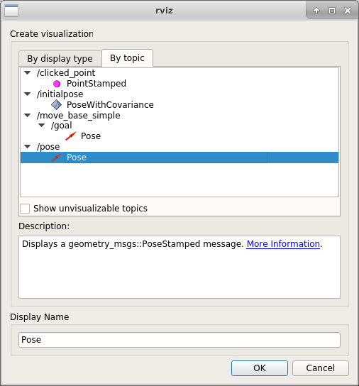</center></div>

If you are working with ROSbot:
Find topic `/pose` and choose `Pose` and click **OK**.

If you are working with Gazebo:
Find topic `/odom` and choose `Odometry` and click **OK**.

Then in visualized items list find position `Fixed Frame` and change it
to `base_link`. At this stage, you will need to type it. Later it will be possible to choose frame names from dropdown list, this will be covered in tutorial 6.

After this is done, you should see an arrow representing position and orientation
of your robot. Move your robot and observe as arrow changes its
position.


 
Visualization of any other item is performed in the same way. In further
lessons, as you will produce more objects to visualize, you will add them
to the same view.

## Summary ##

After completing this tutorial you should be able to control motor
attached to your CORE2 device, set desired velocity for robot with
`geometry_msgs/Twist` message, determine position of your robot using
odometry, publish it as a `PoseStamped` message and visualize position
of your robot using `rviz`.

---------

*by Łukasz Mitka, AGH Krakow*

*Do you need any support with completing this tutorial or have any difficulties with software or hardware? Feel free to describe your thoughts on our community forum: https://community.husarion.com/ or to contact with our support: support@husarion.com*
